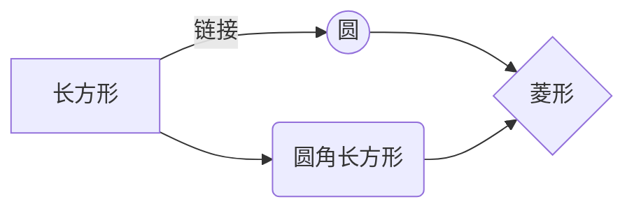
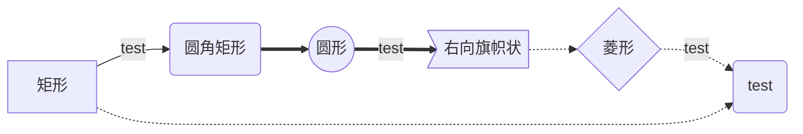
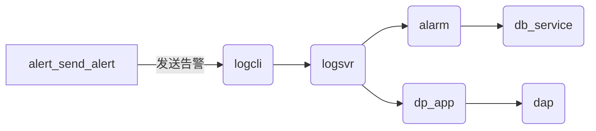
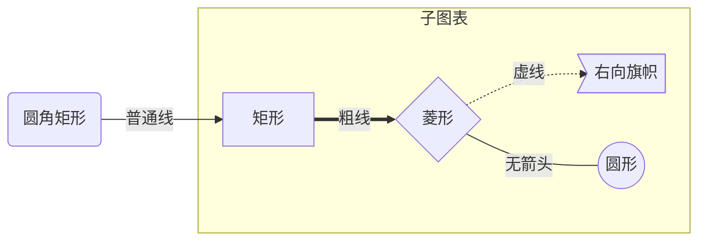
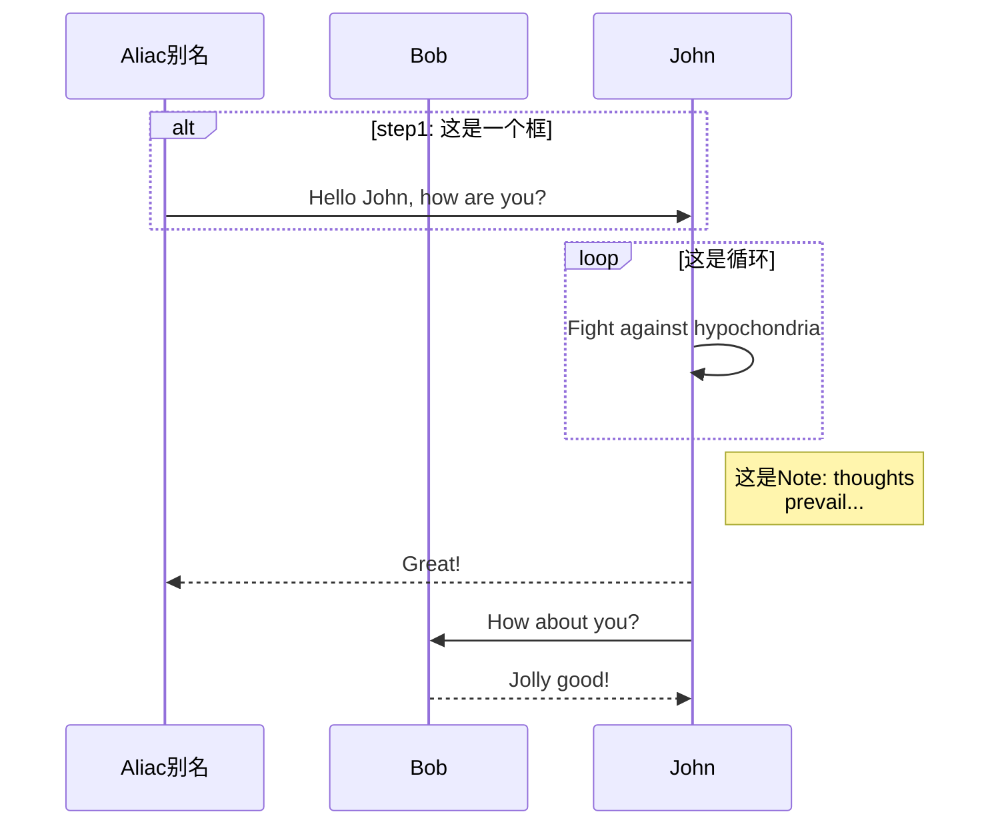
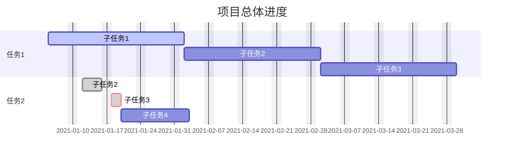
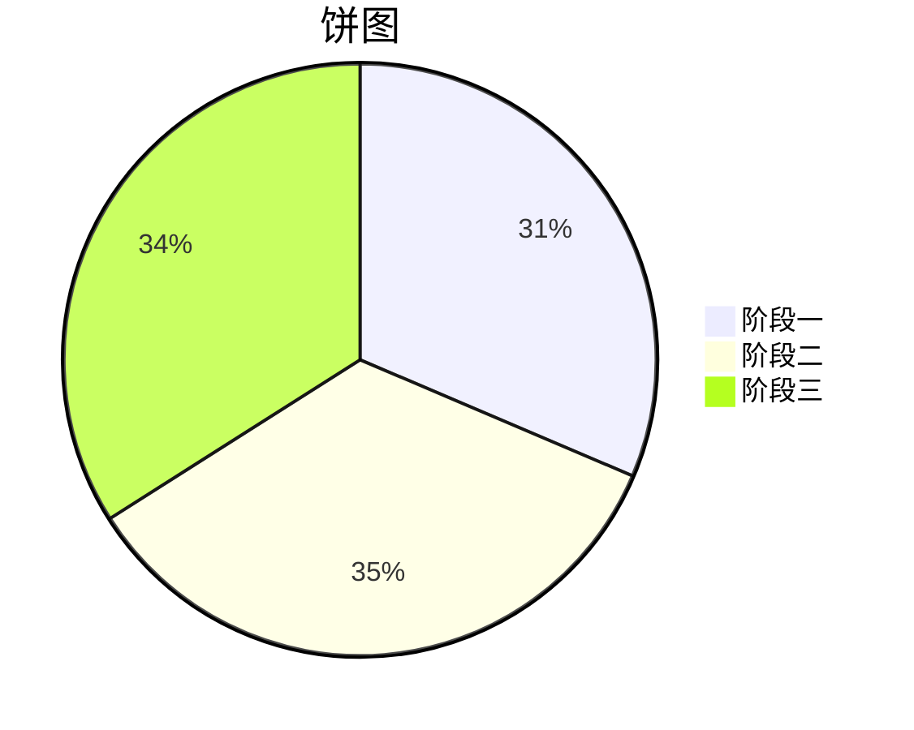
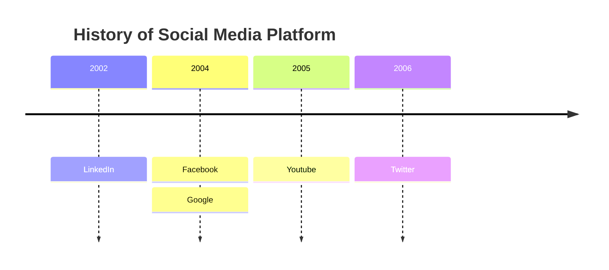
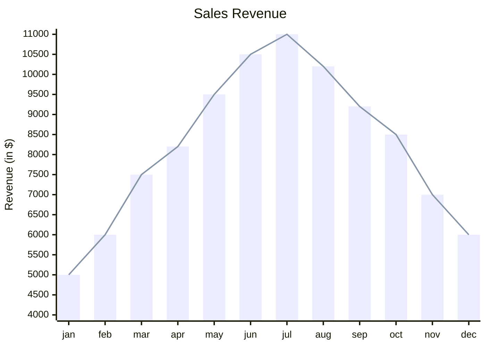

[TOC]

# Markdown

<span id="test">**`锚点测试`**</span>

- 新标签页打开链接

  需要 Markdown 解析器支持

  [example](http://yinping4256.github.io){:target="\_blank"}

  <a href="www.baidu.com" target="_blank">超链接的名字</a>

- 命令模式输入 `5`，插入模式输入 `=` 就可以实现一次性输入 5 个 =

## MPE

- [vscode Markdown 预览样式美化多方案推荐](http://www.bryh.cn/a/643427.html)

- 代码展示行号

  ```py{.line-numbers}
  import os
  print(os.path)

  ```

- 预览时展示外部文件

  ```
  # 很好的功能
  @import "path/to/test.py" {.line-numbers}

  ```

## 微信读书

- [小悦记 - Chrome Web Store](https://chromewebstore.google.com/detail/%E5%B0%8F%E6%82%A6%E8%AE%B0/dcfmienoiahabnladhacocfbhngagpok?hl=zh-CN)

- [GitHub - Higurashi-kagome/wereader: 一个浏览器扩展：主要用于微信读书做笔记，对常使用 Markdown 做笔记的读者比较有帮助。](https://github.com/Higurashi-kagome/wereader)

  打开微信阅读[书籍页面](https://weread.qq.com/web/reader/b71328b056dcccb713a8f38)，浏览器 F12 查看源代码，在 `weread-xxx.file-myqcloud.com/web/wrwebnjlogic/js/app.xxx.js` 脚本中，搜索 `['bookInfo']['xxx']` 其中的 xxx 可用于插件配置 `{{metaData.title}}` 占位符

  [Weread obsidian plugin markdown template usage · zhaohongxuan/obsidian-weread-plugin Wiki · GitHub](https://github.com/zhaohongxuan/obsidian-weread-plugin/wiki/Weread-obsidian-plugin-markdown-template-usage)

## xmind 思维导图

- [vscode 插件 - Markmap](https://blog.csdn.net/Bit_Coders/article/details/122703511)

## PPT

- Reveal.js 是一个使用 HTML 语言制作演示文稿的 Web 框架，支持插入多种格式的内容，并以类似 PPT 的形式呈现。

- [slidev](https://github.com/slidevjs/slidev)

- [Marp](https://www.jianshu.com/p/a31e5a25db5b)

  没必要，相当于你用 markdown 写了一份 css

- [结合 ChatGPT 和 MindShow 自动生成 PPT](https://www.cnblogs.com/zhujiqian/p/17304984.html)

  用 markdown 列出大纲和内容，交给 mindshow 生成 PPT

## 视频

[](https://vdn6.vzuu.com/SD/7402d558-45fe-11ed-9eb3-be9308f7719d.mp4?pkey=AAVY6akkwRdMWgPqkQ-ZtAlM32lHWYHxnT0T1du-KzkXHDSfSgicP-Weg1qHPxK1lj239B_6-ySCg98VUDeAaHlv&c=avc.1.1&f=mp4&pu=078babd7&bu=078babd7&expiration=1687080807&v=ks6)

[](https://git.io/typing-svg)

## 链接

[鼠标悬停提示](https://istio.io/ "鼠标悬停提示")

## HTML

[markdown 编辑器语法——字体、字号与颜色](https://mbzx.github.io/2015/09/21/md-light/)

[Markdown 前景色、背景色](https://blog.51cto.com/u_12358040/5408797)

### 折叠

<details>
  <summary>折叠时展示的文字，默认展示为“详情”</summary>
  展开内容。可以嵌套 markdown 语法。

```log
折叠文本详情

```

</details>

### 居中

### 下划线

- 下划线

  <u>下划线</u>

### 使用 `<font>` 的标签的修改文字前景色

<font color="red">红色</font>
<font color="green">绿色</font>
<font color="blue">蓝色</font>

<font color="rgb(200, 100, 100)">使用 rgb 颜色值</font>

<font color="#FF00BB">使用十六进制颜色值</font>

### 使用 `style` 属性修改文字的背景色

<font style="background: red">红色</font>
<font style="background: green">绿色</font>
<font style="background: blue">蓝色</font>

<font style="background: rgb(200,100,100)">使用 rgb 颜色值</font>

<font style="background: #FF00BB">使用十六进制颜色值</font>

### 更丰富背景样式

<font style="background: url('https://mmbiz.qpic.cn/mmbiz_png/J0g14CUwaZep2LuiajOJOuJEbeufOicOecOlCL7wsjxZkA9ZRqlqDaicBuWpibwwK2s0ubt5cRtl8qoIok73bZricuA/640?wx_fmt=png') ">I wish you a Merry Christmas</font>

### 使用图片作背景

<font style="background: linear-gradient( to right, #ff1616, #ff7716, #ffdc16, #36c945, #10a5ce, #0f0096, #a51eff, #ff1616);">太阳太阳，给我们带来，七色光彩</font>

## emoji

:smile: :flushed: :sweat: :sob: :joy:

:+1: :ok_hand: :point_down: :clap: :muscle: :pray:

:heart: :fire: :boom: :star2: :shit: :zzz:

## 表格

| aa  | bb  | cc  |
| --- | --- | --- |
| 1   |     | 2   |
| 3   | >   | 4   |
| 5   | 6   |     |
| ^   | 7   | 8   |


## 有序列表

1. 第一点概述

   > 需要三个空格

   第一点详情

2. 第二点概述

   第二点详情

## TOC 标题

- 用 `[TOC]` 的好处

  - 有道笔记编辑的时候，不需要关注标题

  - 支持中文横杠

- 规范： 标题不要用反引号【`】

- 不能出现中文的顿号 `## 1、测试？`，否则，有道云笔记无法点击目录跳转；但是有 `？ 或 （）或 双引号“”` 都是可以的（建议改成 `.` 或者 `、` 后面加个空格）

## 图床

### VSCode 插件 PicGo

### 有道云笔记

### base64 离线图

- 原来在 markdown 文件中插入图片，格式是 ``，如果使用图片的 base64 编码, 如下:

  ```sh
  
  或
  ![图片][id]
  或
  [id]:data:image/png,base64;iGmCV...
  ```

- 插入到 Markdown 中

  ```markdown
  // 引用
  ![img-0]

  // 定义
  [img-0]: data:image/png;base64,xxxxxxxxxxxxxxxxx
  ```

## Mermaid

[在线编辑和渲染 mermaid](https://mermaid.live/edit)

[★ 关于 Mermaid | Mermaid 中文网](https://mermaid.nodejs.cn/intro/)

[Markdown Preview Enhance 使用说明](https://shd101wyy.github.io/markdown-preview-enhanced/#/zh-cn/diagrams)

[Mermaid 实用教程](https://blog.csdn.net/fenghuizhidao/article/details/79440583)

[mermaid](http://mermaid.js.org/config/Tutorials.html)

### flow

- 节点定义

  定义方法：`别名=>节点类型: 文字描述`

  | 节点类型      | 含义       |
  | ------------- | ---------- |
  | `start`       | 开始       |
  | `end`         | 结束       |
  | `operation`   | 操作       |
  | `subroutine`  | 子程序     |
  | `condition`   | 条件       |
  | `inputoutput` | 输入或输出 |

```flow
# 定义节点
st=>start: 开始
op=>operation: 操作
cond=>condition: 条件
e=>end: 结束

# 定义节点间关系
st->op->cond
cond(yes)->e
cond(no)->op
```

### 流程图

**图表方向**

| 用词 </br>`top/below/left/right` | 含义     |
| :------------------------------- | :------- |
| `TB`                             | 从上到下 |
| `BT`                             | 从下到上 |
| `RL`                             | 从右到左 |
| `LR`                             | 从左到右 |

**节点定义**

| 表述         | 说明           |
| :----------- | :------------- |
| `id[文字]`   | 矩形节点       |
| `id(文字)`   | 圆角矩形节点   |
| `id((文字))` | 圆形节点       |
| `id>文字]`   | 右向旗帜状节点 |
| `id{文字}`   | 菱形节点       |

**连线定义**

| 表述       | 说明           |
| :--------- | :------------- |
| `>`        | 添加尾部箭头   |
| `-`        | 不添加尾部箭头 |
| `--`       | 单线           |
| `--text--` | 单线上加文字   |
| `==`       | 粗线           |
| `==text==` | 粗线加文字     |
| `-.-`      | 虚线           |
| `-.text.-` | 虚线加文字     |









### 思维导图

vscode 有 markmind 插件，可以把 markdown 展示为思维导图

### sequenceDiagram 时序图



### UML

字符画

```ditaa{cmd=true args=["-E"]}
                            +---------------------------------------------------------------+
                            |                                                               |
                            |  +------------------------------------------+                 |
       [DEALER]             |  |                                          |       [DEALER]  |                   4                                        6
    +-------------+         |  |  [ROUTER]                     [DEALER]   |      +--------+ |          +-----------------+            5             +---------+
    |             |   1     |  | +---------+        2         +---------+ |      |        | |          |     res_id      |      +------------+      |         |
    |     REQ     +<------->+  | |         |  +-----------+   |         | |  3   |        | +--------->+       &         +----->+ sqlalchemy +----->+  Mysql  |
    |             |         |  | |[  REP  ]+--+ zmp.proxy +-->+[  REQ  ]| +----->+[ REQ ] | |          | module_register |      +------------+      |         |
    +-------------+         |  | |         |  +-----------+   |         | |      |        | |          +-----------------+                          +---------+
      [db_client]           |  | +---------+                  +---------+ |      |        | |
                            |  |                                          |      +--------+ |
                            |  +---------------+broker+-------------------+                 |
                            |                [db_service]                         [worker]  |
                            |                                                               |
                            +---------------------------------------------------------------+
```

```ditaa {cmd=true args=["-E"]}
+--------+   +-------+    +-------+
|        | --+ ditaa +--> |       |
|  Text  |   +-------+    |diagram|
|Document|   |!magic!|    |       |
|     {d}|   |       |    |       |
+---+----+   +-------+    +-------+
  :                         ^
  |       Lots of work      |
  +-------------------------+
```

### 甘特图

[在线甘特图|在线项目管理工具 - 知竹](https://www.yxsss.com/)

[Markdown mermaid 甘特图](https://blog.csdn.net/horsee/article/details/113725299)

在 Mermaid 的 Gantt 图中，dateFormat 目前不支持直接指定年份。dateFormat 只允许你定义日期的格式，例如 MM-DD 或 YYYY-MM-DD，但在 Gantt 图中，日期的年份通常是隐含的。 如果你希望在 Gantt 图中显示特定年份的日期，可以在任务的日期中直接包含年份。例如，你可以将日期格式改为 YYYY-MM-DD，并在任务中指定完整的日期。以下是一个示例：



### 扇形图

必须要双引号，且没法写注释



### 时间轴



### 柱状图



## 锚点

[MARKDOWN 设置目录、锚点](https://www.cnblogs.com/niuben/p/13139023.html)

[点击跳转到锚点](#test)

- 也可以这样用 `#` 引用另外一个 MD 文档，并定位到指定的目录

  ```log
  [aaaaaaaaaaaaaaa](xxxx.md#我是目录)
  ```

## 脚注

相比锚点，脚注好点，脚注还能跳回去；但是脚注只能一个地方用，锚点可以放多个

==点击跳转到脚注== [^1]

## 数学公式 `Latex`

[Markdown 中 LaTex 数学公式命令](https://www.jianshu.com/p/0ea47ae02262)

- 行内公式

  ```sh
  $...$
  ```

  asdfasfasd asdfas $\sum*{i=0}^{n}i^2$ asdfasdfas

- 独行公式

  ```sh
  $$...$$
  ```

  $$a*1^{k+1} = a_1^k + step_k$$

- 上下标

  ```sh
  # 上标
  a^{2}
  ```

  $$a^{2}$$

  ```sh
  # 下标
  a_{3}
  ```

  $$a_{3}$$

  混用：$x^{y^{z}}$、$x_{y}^{z}$

- `infty`

  $$\int_{-\infty}^\infty e^{-x^2} = \sqrt{\pi}$$

- 求和

  ```sh
  \sum
  ```

  $$\sum{adf}$$

- 开方

  ```sh
  \sqrt
  ```

  $c=\sqrt{a^{2}+b_{x}^{2}+e^{x}}$

- 分支公式

  ```latex
  $$
  y = \begin{cases}
  -x,\quad &x \leq 0 \\
  x, &x>0
  \end{cases}
  $$
  ```

  $$
  y = \begin{cases}
  -x,\quad &x \leq 0 \\
  x, &x>0
  \end{cases}
  $$

### 上标下标

```markdown
30^th^

H~2~O
```

30^th^

H~2~O

### 代码块带上行号

```javascript {.line-numbers}
function add(x, y) {
  return x + y;
}
```

```python{cmd=true .line-numbers}
import time
print(time.time())

```

# 有道云笔记

- 有道云笔记也支持流程图，也支持 mermaid，但是不需要在代码块说明

  ````log
  <!-- MPE 需要用，有道云笔记则不需要：```sequence {theme="hand"} -->
  ````

- 有道云笔记的甘特图不支持 axisFormat 和 todayMarker

  ```markdown
  gantt

  title 每日安排
  dateFormat HH:mm

  section 星期一二四

  上班路上 :08:20,09:15
  上午 :09:15,12:00
  吃饭休息 :12:00,14:10
  下午 :14:10,18:00
  抽空 :crit, 17:00,18:00
  吃饭休息 :18:00,19:00
  晚上 :crit,19:00,20:50
  下班路上 :20:50,21:50
  放松休息 :21:50,23:00
  深夜 :crit, 23:00,24:00

  section 星期三五
  下班路上 :19:00,20:00
  休息放松 :20:00,22:30
  学习时间 :crit, 22:00,24:00

  section 周末
  上午（一般都会睡懒觉） :a1, 09:00,12:00
  午休（时间不确定） :a2, 12:00,15:00
  下午（睡眼惺忪） :crit, a3, 15:00,19:00
  晚上（肯定会熬夜） :crit, a4, 19:00,24:00
  ```

  ```
  gantt

  title 20220718 周计划
  dateFormat MM-DD

  星期 一                       :a1, 07-18, 1d
  递归算法                      :a2, after a1, 6d
  Redis 数据结构、缓存、选型     :a2, after a1, 2d
  MySQL 索引和事务              :a3, after a2, 2d
  星期 六（休息）               :a4, after a3, 1d
  星期 日（总结）               :a5, after a4, 1d

  ```

- 块内高亮

  支持 success info warning danger

  ::: success
  success
  :::

# VSCode 高亮

> 安装 [Markdown Extended](https://marketplace.visualstudio.com/items?itemName=jebbs.markdown-extended) 扩展，支持更多预览语法: https://mybyways.com/blog/customizing-vs-code-for-markdown-note-taking

```md
TICKTICK-0%
TICKTICK-25%
TICKTICK-50%
TICKTICK-75%
TAG
NOTICE
WARNNING
[ ]
TODO
XXX
ERROR
FIXME
```

支持这些图标

```
note, summary, question, hint
注意、摘要、问题、提示
todo, done, fail  todo， 完成， 失败
warning, danger  警告， 危险
```

!!! summary "总结"

    这是文章的核心内容。

!!! tip "提示"

    这是一个有用的提示。

!!! warning "警告"

    这是一个重要的警告信息。

!!! note "标注"

    这是一个需要注意的标注。

!!! error "错误"

    这是一个错误信息。

!!! info "信息"

    这是一个普通的信息。

!!! question "问题"

    这是一个需要思考的问题。

!!! example "示例"

    这是一个示例。

!!! seealso "参见"

    参见其他相关的内容。

!!! success "成功"

    这是一个成功的信息。

!!! danger "危险"

    这是一个危险的信息。

# Github

> [!Note]
> This repo contains the algorithm infrastructure and some simple examples.
>
> [!Tip]
> For the extended end-user products, please refer to the index repo [Awesome-ChatTTS](https://github.com/libukai/Awesome-ChatTTS/tree/en) maintained by the community.
>
> [!Important]
> This repo is for academic purposes only.

- 这里可的改动记录在 github 上会有不同的颜色

  ```go
  func (l *GreetLogic) Greet(req types.Request) (*types.Response, error) {
  +   return &types.Response{
  +       Message: "Hello go-zero",
  +   }, nil
  -   return
  }
  ```

- github 支持 `自动选择` 展示明亮或黑暗模式下的内容

  `#gh-light-mode-only` 和 `#gh-dark-mode-only` 是 GitHub 特有的标记，用于指定在明亮模式或黑暗模式下显示的内容。

  ```md
  

  
  ```

# 编辑器

## md-to-pdf

[md-to-pdf](https://github.com/simonhaenisch/md-to-pdf)

> 参考 markdown preview enhanced 插件，支持 Chrome (puppeteer)、pandoc、prince 几种导出方案；这个工具和 markdownPreviewEnhanced 一样，通过 puppeteer 进行转换
>
> Marked 将 markdown 转换为 html ，并使用 Puppeteer (headless Chromium) 将 html 进一步转换为 pdf 。它还使用 highlight.js 进行代码突出显示

- md-to-pdf 指定 chrome 路径，不需要下载

  > 支持的不是很全，mermaid 图不支持

  ```sh
  export PUPPETEER_EXECUTABLE_PATH="C:\Program Files (x86)\Microsoft\Edge\Application\msedge.exe"

  ```

- [puppeteer 可选选项](https://pptr.dev/api/puppeteer.pdfoptions)

- [不支持 TOC](https://github.com/simonhaenisch/md-to-pdf/issues/74)

- 不支持 mermaid

- kimi 返回的 markdown 格式解析得还可以

- 来自微信的图片无法显示

  - [解决显示“此图片来自微信公众平台未经允许不可引用”错误图片-CSDN 博客](https://blog.csdn.net/qq_42961150/article/details/121833692)

- 支持代码渲染

## 在线编辑器

- [GitHub - doocs/md: 一款高度简洁的微信 Markdown 编辑器：支持 Markdown 语法、色盘取色、多图上传、一键下载文档、自定义 CSS 样式、一键重置等特性](https://github.com/doocs/md)

- [GitHub - shenweiyan/Markdown2Html: 一款 Markdown 转 Html，支持掘金、知乎和微信公众号的编辑器。](https://github.com/shenweiyan/Markdown2Html)

  [Markdown2Html 全面使用教程：从入门到精通](https://blog.csdn.net/qq_40999403/article/details/140129103)

  不支持 mermaid 公式

## 主题

- [GitHub - doocs/md 主题](https://github.com/doocs/md)

- [markdown-nice 主题列表](https://product.mdnice.com/themes/)

- [掘金 markdown 主题](https://github.com/xitu/juejin-markdown-themes)

  - https://github.com/ChanningHan/juejin-markdown-theme-channing-cyan

  - https://github.com/RudeCrab/juejin-markdown-theme-rude-crab

# 其他

- [MarkdownPreviewEnhanced](https://shd101wyy.github.io/markdown-preview-enhanced/#/zh-cn/)

- [Markdownlint](https://www.cnblogs.com/henry-chr/p/14715741.html)

- [markdown 语法检查工具](https://github.com/DavidAnson/markdownlint)

- [markdown 格式化工具](https://github.com/executablebooks/mdformat)

- [markdown css 主题](https://github.com/macrozheng/mall-learning/blob/master/document/json/localThemeList.json)

- [typora 主题列表](https://theme.typora.io/)

- [weixin markdown 表格不生效](https://blog.csdn.net/qq_23633427/article/details/107374306#:~:text=%E7%BB%8F%E4%BF%AE%E6%94%B9%E5%90%8E%E7%94%9F%E6%95%88%EF%BC%8C%E5%8E%9F%E5%9B%A0%E6%98%AF%EF%BC%9A%E8%A1%A8%E6%A0%BC%E7%9A%84%E8%AF%AD%E5%8F%A5%E4%B8%8A%E4%B8%80%E8%A1%8C%E5%BF%85%E9%A1%BB%E4%B8%BA%E7%A9%BA%E8%A1%8C%EF%BC%8C%E4%B8%8D%E7%84%B6%E8%A1%A8%E6%A0%BC%E4%B8%8D%E7%94%9F%E6%95%88%E3%80%82)
